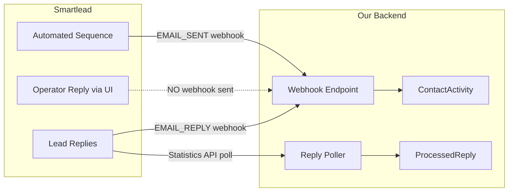
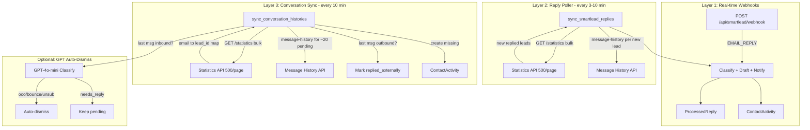
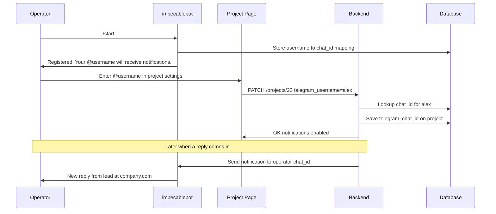

# Auto-Replies Production Architecture

Two phases: first make "needs reply" accurate 24/7, then let operators get notified in Telegram per-project.

---

## Phase 1: Fix Conversation History (Needs Reply Detection)

### The Problem

932 Rizzult replies show as "needs reply" when the real number is far lower. Root cause: **manual operator replies sent from Smartlead's master inbox UI do not trigger `EMAIL_SENT` webhooks**. Our system only learns about outbound messages via webhooks, so it never sees these replies.

### Current State




**What's tracked today:**

- Inbound replies: via `EMAIL_REPLY` webhook + polling fallback (robust)
- Automated outbound emails: via `EMAIL_SENT` webhook (when delivered)
- Operator manual replies: **NOT tracked** (the gap)

### Solution: Bulk Statistics + Message History Sync

Three-layer architecture for reply tracking:




### Implementation (Updated Feb 12 2026)

**Key change:** Both `sync_conversation_histories()` and `sync_outbound_status()`
now use **bulk statistics endpoint** (GET /campaigns/{id}/statistics, 500/page) to
resolve email→lead_id, instead of per-lead API calls. This eliminates 429 errors.

**File: [backend/app/services/crm_sync_service.py**](backend/app/services/crm_sync_service.py) — `sync_conversation_histories()`:

1. Query `ProcessedReply` where pending + no outbound `ContactActivity` after `received_at`
2. Deduplicate by `(campaign_id, lead_email)`
3. **Bulk-fetch statistics** per campaign → build email→lead_id map (~5 calls per campaign)
4. Fallback: webhook data → Contact.smartlead_id (if not in statistics)
5. Fetch message-history with **adaptive delay** (1.5s start, 2x on 429, 0.9x on success)
6. If last message is outbound → mark `replied_externally` + create `ContactActivity`
7. If last message is inbound + `auto_dismiss=true` → GPT-4o-mini classify

**File: [backend/app/api/replies.py**](backend/app/api/replies.py) — `sync_outbound_status()` (manual trigger):

- Same bulk statistics approach as above
- Supports `project_id`, `auto_dismiss`, `dry_run` parameters
- Returns detailed breakdown with `already_replied`, `still_pending`, `auto_dismissed`
- New: `_classify_reply_needs_action()` GPT helper
- New: `GET /campaign/{id}/analytics-summary` returns Smartlead-matching stats

**File: [backend/app/services/crm_scheduler.py**](backend/app/services/crm_scheduler.py) — `_run_conversation_sync_loop()` every 10 min.

**API cost:** ~5 statistics calls + ~20 message-history calls per sync = ~25 total. Adaptive delay prevents 429s.

---

## Phase 2: Per-Project Telegram Notifications

### The Flow




### Implementation

**1. New model** in [backend/app/models/reply.py](backend/app/models/reply.py):

```python
class TelegramRegistration(Base, TimestampMixin):
    __tablename__ = "telegram_registrations"
    id = Column(Integer, primary_key=True)
    telegram_username = Column(String(100), unique=True, index=True)  # lowercase, no @
    telegram_chat_id = Column(String(100), nullable=False)
    telegram_first_name = Column(String(100), nullable=True)
    registered_at = Column(DateTime, default=datetime.utcnow)
```

**2. Bot webhook endpoint** — new route handling `/start` command:

- Extracts `username` and `chat_id` from Telegram update
- Upserts into `telegram_registrations`
- Replies with confirmation message

**3. Project update** in [backend/app/api/contacts.py](backend/app/api/contacts.py):

- Accept `telegram_username` field
- Lookup `telegram_registrations` to resolve to `chat_id`
- If not found, return error: "User hasn't registered with the bot yet"

**4. Add `telegram_username` to Project model** in [backend/app/models/contact.py](backend/app/models/contact.py):

- Persists the @username so UI can display it
- `telegram_chat_id` (already exists) stores the resolved numeric ID

**5. Frontend** in [frontend/src/pages/ProjectsPage.tsx](frontend/src/pages/ProjectsPage.tsx):

- Add "Telegram Notifications" section to project edit form
- Text input for `@username`
- Helper text: "Open @impecablebot and send /start first"
- Green checkmark when active, amber warning when username not yet registered

**6. Frontend types** in [frontend/src/api/contacts.ts](frontend/src/api/contacts.ts):

- Add `telegram_username` to Project interfaces and `updateProject()` params

**Already done:**

- `telegram_chat_id` field exists on `Project` model
- [backend/app/services/notification_service.py](backend/app/services/notification_service.py) already routes notifications to project operators via `telegram_chat_id` (line 769-780)
- All `EMAIL_REPLY` events trigger `notify_reply_needs_attention()` which checks for project routing
- No changes needed to notification_service.py — once `telegram_chat_id` is set, notifications flow automatically

**One-time setup:** Register bot webhook URL with Telegram:

```
POST https://api.telegram.org/bot{TOKEN}/setWebhook?url=https://46.62.210.24:8000/api/replies/telegram/webhook
```

