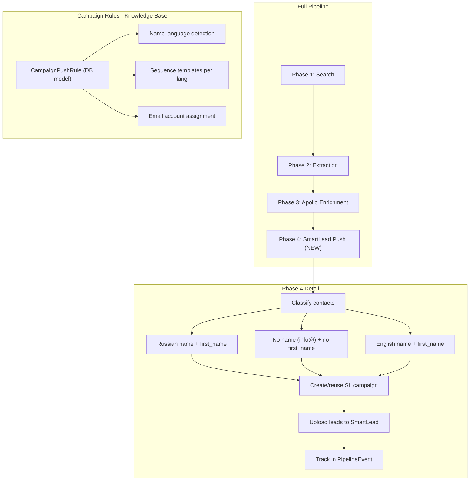

# SmartLead Campaign Auto-Push and Pipeline UI

## Architecture




## 1. Core: Campaign Push Rules Engine

### New DB Model: `CampaignPushRule`

Add to [backend/app/models/pipeline.py](backend/app/models/pipeline.py):

```python
class CampaignPushRule(Base):
    __tablename__ = "campaign_push_rules"
    id: int (PK)
    project_id: int (FK projects)
    name: str  # e.g. "Russian names", "No name", "English names"
    description: str
    
    # Classification criteria
    language: str  # "ru", "en", "any"
    has_first_name: bool  # True = requires first_name, False = info@/contact@ etc.
    name_pattern: str  # optional regex for name detection
    
    # SmartLead campaign config
    campaign_name_template: str  # e.g. "Deliryo {date} Из РФ"
    sequence_language: str  # "ru" or "en"
    sequence_template: JSON  # sequences array for SmartLead API
    use_first_name_var: bool  # whether to use {{first_name}} in sequences
    
    # Campaign settings
    email_account_ids: JSON  # list of SmartLead email account IDs to assign
    schedule_config: JSON  # timezone, days, hours, limits
    campaign_settings: JSON  # tracking, plain text, follow-up %
    
    # Limits
    max_leads_per_campaign: int = 500
    priority: int = 0  # higher = checked first
    is_active: bool = True
    
    created_at, updated_at
```

### Name Language Detection Service

New file: [backend/app/services/name_classifier.py](backend/app/services/name_classifier.py)

- Detect if a name is Russian (Cyrillic characters) vs English (Latin)
- Detect "generic" emails: `info@`, `contact@`, `office@`, `hello@`, `support@` etc.
- Classify each `ExtractedContact` into a rule bucket

Logic:

1. If email starts with generic prefix AND no first_name --> "no_name" bucket
2. If first_name contains Cyrillic --> "ru" bucket
3. Else --> "en" bucket

### Pipeline Phase 4: SmartLead Push

Add to [backend/app/api/pipeline.py](backend/app/api/pipeline.py) -- new function `_bg_phase_smartlead_push`:

1. Load active `CampaignPushRule` records for the project
2. Query all target contacts with email, excluding already-in-SmartLead (same filter as export)
3. Classify each contact using name_classifier
4. For each rule bucket with contacts:
  - Create new SmartLead campaign (or reuse if under `max_leads_per_campaign`)
  - Set sequences from rule's `sequence_template`
  - Set schedule from rule's `schedule_config`
  - Assign email accounts from rule's `email_account_ids`
  - Upload leads in batches
5. Record all actions in `PipelineEvent` for audit trail
6. Insert pushed contacts into `contacts` table (to prevent re-push)

### Sequence Generation with Gemini 2.5 Pro

New endpoint in [backend/app/api/pipeline.py](backend/app/api/pipeline.py):

- `POST /pipeline/generate-sequences` -- uses Gemini 2.5 Pro to generate email sequences
- Input: project knowledge base context, language, tone, whether to use `{{first_name}}`
- Output: SmartLead-formatted sequences array
- Can be called from UI when creating/editing push rules

## 2. Backend API Endpoints

### Campaign Push Rules CRUD

Add to [backend/app/api/pipeline.py](backend/app/api/pipeline.py):

- `GET /pipeline/projects/{id}/push-rules` -- list rules
- `POST /pipeline/projects/{id}/push-rules` -- create rule
- `PUT /pipeline/push-rules/{id}` -- update rule
- `DELETE /pipeline/push-rules/{id}` -- delete rule
- `POST /pipeline/projects/{id}/push-rules/generate` -- AI-generate rules from project context

### Pipeline Control (already exists, extend)

- `POST /pipeline/full-pipeline/{id}` -- add `skip_smartlead_push: bool` param
- Status endpoint already shows phase info -- add phase 4 stats

### Pipeline Chat Extension

Extend [backend/app/api/search_chat.py](backend/app/api/search_chat.py):

Add intent parsing for:

- "launch pipeline for deliryo" --> starts full pipeline
- "stop pipeline" --> stops running pipeline  
- "push contacts to smartlead" --> runs phase 4 only
- "show pipeline status" --> returns current progress
- "show targets" --> returns target companies with reasoning

## 3. UI Changes

### Pipeline Page -- Campaign Push Rules Editor

Add to [frontend/src/pages/SearchResultsPage.tsx](frontend/src/pages/SearchResultsPage.tsx) or create new tab:

- **Rules list**: Table showing active push rules for the selected project
- **Rule editor**: Form with:
  - Name, language (ru/en/any), has_first_name toggle
  - Campaign name template with `{date}` variable
  - Sequence editor (rich text with `{{first_name}}` variable)
  - "Generate with AI" button (calls Gemini 2.5 Pro)
  - Email account selector (multi-select from SmartLead accounts)
  - Schedule settings
  - Max leads per campaign
- **Push button**: "Push to SmartLead" -- runs phase 4 for current project

### Pipeline Status in Search Results Page

Extend the existing pipeline banner to show all 4 phases with progress:

```
Phase 1: Search [DONE] -- 50 new targets
Phase 2: Extraction [DONE] -- 23 contacts found  
Phase 3: Apollo [DONE] -- 15 enriched
Phase 4: SmartLead Push [RUNNING] -- 12/70 uploaded (3 campaigns)
```

### Target Companies Viewer

Add section/tab showing target companies with:

- Domain, company name, confidence score
- "Why target" reasoning from AI analysis (`company_info.reasoning`)
- Contacts found per company
- Which campaign they were pushed to

### Chat Integration

The existing chat on DataSearchPage already supports conversational commands. Extend the backend intent parser to handle:

- Pipeline launch/stop/status commands
- "Push to smartlead" command
- "Show targets" command

## 4. Default Deliryo Rules

Pre-seed 3 rules for project 18 (Deliryo):


| Rule            | Language | Has Name | Campaign Template                 | Sequences                      |
| --------------- | -------- | -------- | --------------------------------- | ------------------------------ |
| Russian + name  | ru       | yes      | `Deliryo {date} Из РФ`            | Russian, with `{{first_name}}` |
| Russian no name | any      | no       | `Deliryo {date} Из РФ БЕЗ ИМЕНИ`  | Russian, no `{{first_name}}`   |
| English + name  | en       | yes      | `Deliryo {date} Из РФ Англ имена` | English, with `{{first_name}}` |


## 5. Audit Trail

All pipeline actions stored in existing `PipelineEvent` model:

- Query used, domains scraped, contacts extracted, Apollo filters applied
- SmartLead campaigns created, leads uploaded per campaign
- Full traceable history to reproduce any pipeline run

## Implementation Order

The work is split into phases to deliver value incrementally:

1. **Core engine** (model + classifier + Phase 4 backend)
2. **Default Deliryo rules + first push** (immediate value)
3. **UI: Push rules editor + pipeline status**
4. **UI: Target companies viewer**
5. **Chat pipeline commands**
6. **Gemini sequence generation**

